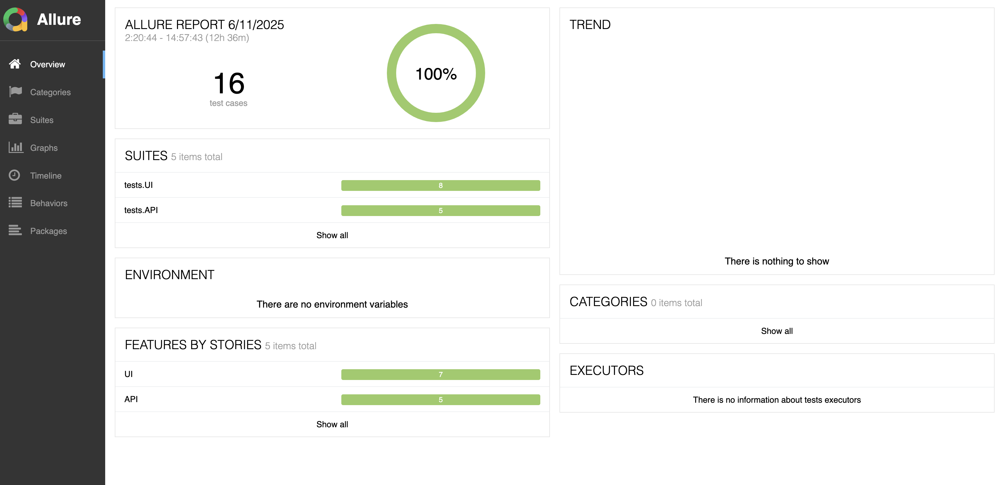

<h1>Apple TV Web Testing Project</h1>
<a target="_blank" href="https://tv.apple.com/">Apple TV</a>

<h2> UI: </h2>

* Checking the functionality of the buttons  
* Checking the availability of registration options  
* Registering a user with a valid email address   
* Registering a user with an invalid email address  
* Going to the selected section of the site  
* Searching for a movie by title   
* Selecting movies by a respectful category

<h2> API: </h2>

* Checking authorization on the site
* Checking the site search  
* Checking the functionality of the button MLS    
* Going to the selected section of the site
* Trailer launch check

<h2> Allure report </h2>

